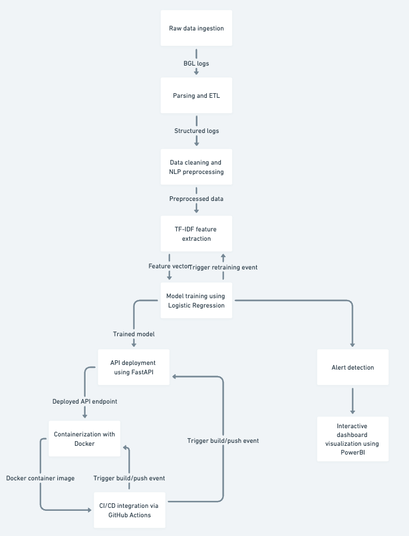

# BGL Log Classification API

*A comprehensive solution that transforms raw BGL logs into actionable insights through advanced NLP, robust API deployment, and interactive PowerBI dashboards.*

---

## Project Overview

Modern organizations rely on effective log analysis to ensure system reliability and prompt detection of anomalies. The **BGL Log Classification API** leverages advanced natural language processing (NLP) techniques to automatically classify log messages from a Blue Gene/L (BGL) system into alert and non-alert categories. This end-to-end project covers data ingestion, ETL, NLP preprocessing, model training, API deployment with FastAPI, containerization with Docker, CI/CD integration, and interactive dashboard visualization using PowerBI.

---

## Data Story

### Aim & Goal
- **Aim:** Develop a data-driven system to monitor log data and predict alerts, enabling proactive maintenance and rapid response to system anomalies.
- **Goal:** Transform raw BGL logs into structured data, clean and preprocess the logs for NLP analysis, build a predictive model, and deploy a production-ready API while visualizing the results with an interactive dashboard.

### Problem Statement
Log data from supercomputer systems, like those from BGL, can be massive and unstructured. Traditional monitoring methods struggle to detect anomalies effectively. Our project addresses this challenge by automating the classification of log messages using modern NLP and machine learning techniques, ultimately providing real-time alert detection and insightful visualizations.

### Our Solution
1. **Data Ingestion & ETL:**  
   - Raw BGL log files are parsed and transformed into a structured format.
2. **Data Cleaning & NLP Preprocessing:**  
   - Log messages are cleaned and tokenized, and TF-IDF features are extracted for model training.
3. **Model Training:**  
   - A Logistic Regression classifier is trained to distinguish between alert and non-alert logs.
4. **API Deployment:**  
   - A FastAPI application serves the predictive model, enabling real-time classification.
5. **Containerization & CI/CD:**  
   - The API is containerized with Docker and integrated with GitHub Actions for continuous testing and deployment.
6. **Dashboard Integration:**  
   - A PowerBI dashboard visualizes key metrics, trends, and classification results, providing actionable insights.

---

## Project Workflow Diagram



*The diagram illustrates the complete pipeline: from raw data ingestion and parsing, through cleaning and NLP preprocessing, model training, and finally API deployment, containerization, CI/CD integration, and interactive dashboard visualization.*

---

## Key Skills Covered

- **Data Engineering & ETL:** Parsing large log files and transforming unstructured data into a structured format.
- **Natural Language Processing (NLP):** Cleaning, tokenizing, and feature extraction using TF-IDF.
- **Machine Learning:** Building and evaluating a Logistic Regression model for log classification.
- **API Development:** Deploying a production-ready API with FastAPI.
- **Containerization:** Using Docker to ensure consistent deployment across environments.
- **CI/CD:** Automating testing, building, and deployment with GitHub Actions.
- **Data Visualization:** Creating interactive dashboards using PowerBI to monitor system health and performance.

---

## Project Setup

### Prerequisites
- Python 3.9+
- Docker
- Git & Git LFS (for managing large files, if applicable)
- Access to PowerBI for dashboard visualization

### Local Setup
1. **Clone the Repository:**
   ```bash
   git clone https://github.com/asadkhan5456/predictive_nlp_log_classification.git
   cd predictive_nlp_log_classification

2. **Download the Dataset:**
Download the [BGL Log Dataset](https://www.kaggle.com/datasets/beosup/bgl-log-dataset) from Kaggle and place the raw log file in the data/raw/ folder.

3. **Run the ETL Pipeline:**
   ```bash
   python src/etl/etl_pipeline.py
   
4. **Train the Model:**
   ```bash
   python src/model/train_model.py

5. **Run the API Locally:**
   ```bash
   uvicorn src.api.app:app --reload
Visit http://localhost:8000 to verify the welcome message.

6. **Test the API Endpoint: Send a POST request to /predict with a sample log message:**
    ```json
   {
  "log_message": "Your sample log message here..."
}

### Docker
1. **Build the Docker Image:**
   ```bash
   docker build -t bgl-log-api

2. **Run the Docker Container:**
   ```bash
   docker run -d -p 8001:8000 bgl-log-api
   
Access the API at http://localhost:8001.

### CI/CD

The GitHub Actions workflow in .github/workflows/docker_build.yml automatically runs tests, builds the Docker image, and verifies the API on every push to the main branch.

### Dashboard Integration

An interactive PowerBI dashboard is available to visualize:

- Alert vs. non-alert log counts
- Prediction trends over time
- Performance metrics (accuracy, precision, recall)
- Additional insights to monitor system health

**To set up the dashboard:**

Open the PowerBI file (dashboard/dashboard.pbix) provided in the repository.
Connect the dashboard to the live API endpoint or load the processed data.
Customize the visualizations as needed.

### Data Source Credit

If you use this project for research, please cite the original BGL Log Dataset from Kaggle.

### Contributors

Asad Khan 

### License

This project is licensed under the MIT License.

**By integrating data engineering, NLP, machine learning, API development, containerization, CI/CD, and data visualization, this project demonstrates a complete, production-ready pipeline for log classification and anomaly detection.**


